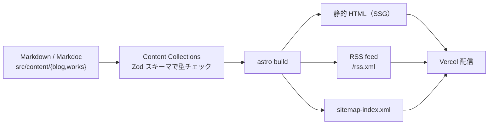
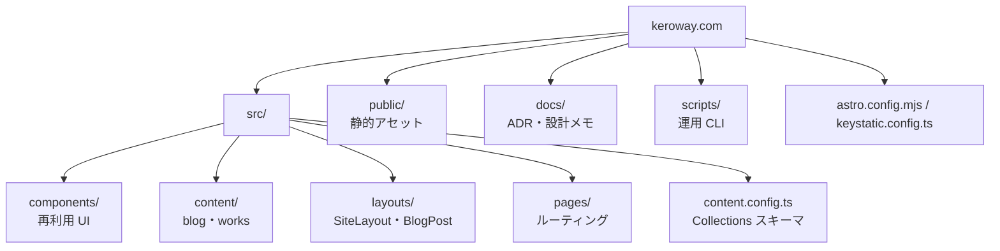
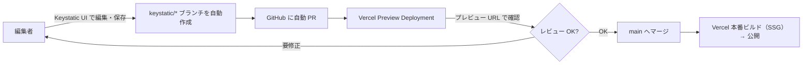
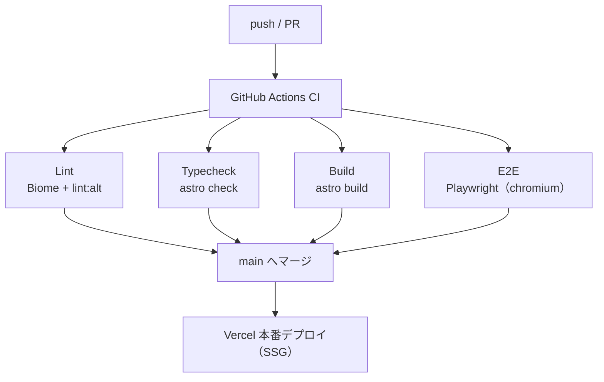

# keroway.com


エンジニア keroway のポートフォリオ・技術ブログです。Astro 6 をベースに、制作物紹介（Works）とブログ記事を一元管理するポートフォリオサイトを構築しています。コンテンツの編集は Git ベースの CMS（Keystatic）から行え、main への PR マージで Vercel に自動デプロイされます。

## 主な特徴

- Works（制作物紹介）と Blog（技術記事）を統合したポートフォリオ構成
- 日本語を含む記事スラッグを自動 URL エンコードして、Vercel などのホスティングでも安全に配信
- 16:9 のサムネイル比率で統一したレスポンシブなカードグリッド表示とホバーインタラクション
- Astro Content Collections による Markdown/Markdoc 記事管理と型チェック
- [Keystatic](https://keystatic.com/) による Git ベースの管理（CMS）UI（ローカル / GitHub ブランチモード）
- RSS フィードとサイトマップを自動生成
- `SiteLayout` レイアウトでページ共通のメタデータ・ナビゲーションを一元管理し、アクセシビリティと reduced motion を考慮した UI
- UnoCSS + コンポーネントスコープの純 CSS で構成（CSS-in-JS 不使用）

## 技術スタック

| 領域 | 採用技術 |
|------|---------|
| フレームワーク | [Astro 6](https://astro.build/) + TypeScript（strict モード有効） |
| コンテンツ | Astro Content Collections（Markdown/Markdoc）、[@astrojs/markdoc](https://docs.astro.build/en/guides/integrations-guide/markdoc/) |
| CMS | [Keystatic](https://keystatic.com/)（`@keystatic/astro` + `@keystatic/core`、admin UI は React で hydrate） |
| スタイル | [UnoCSS](https://unocss.dev/) + コンポーネントスコープの純 CSS |
| 配信補助 | [@astrojs/rss](https://docs.astro.build/en/guides/rss/)（RSS）、[@astrojs/sitemap](https://docs.astro.build/en/guides/integrations-guide/sitemap/)（XML サイトマップ） |
| 画像最適化 | [astro:assets](https://docs.astro.build/en/guides/images/)（自動フォーマット変換・リサイズ） |
| ページ遷移 | [View Transitions](https://docs.astro.build/en/guides/view-transitions/) |
| テスト / Lint | [Playwright](https://playwright.dev/)（E2E）、[Biome](https://biomejs.dev/)（lint / format） |
| パッケージ管理 | pnpm 11.1.3（`package.json` の `packageManager` 参照、サプライチェーン保護有効化） |
| ランタイム | Node.js >= 22.12.0（Astro 6 の要件、偶数 LTS） |
| デプロイ | [Vercel](https://vercel.com/)（`@astrojs/vercel` adapter、静的生成 + `/keystatic` のみ on-demand） |

バージョンは常に `package.json` を一次ソースとします。

## セットアップ

```bash
pnpm install
pnpm run dev
```

- 開発サーバー: <https://keroway.localhost>（`pnpm run dev` は portless 経由。初回のみ HTTPS proxy 用に sudo 昇格）。素の `astro dev`（<http://localhost:4321>）は `pnpm run dev:astro`
- 本番ビルド: `pnpm run build`（`astro check && astro build`）
- ビルドのローカル確認: `pnpm run preview`

> `pnpm install` では同梱の `.npmrc` を利用しており、npm レジストリへのアクセス制限がある環境では `COREPACK_NPM_REGISTRY` を適宜設定してください。

## アーキテクチャ

### コンテンツパイプライン

Markdown/Markdoc を正本とし、Content Collections のスキーマで型検証したうえで静的出力します。RSS・サイトマップはビルド時に併せて生成されます。



### ディレクトリ / 構成図



実ファイルツリーは以下のとおりです。

```
├── public/               # 静的アセット（画像・フォントなど）
├── src/
│   ├── components/       # Header や日付フォーマッタなどの再利用コンポーネント（aria 属性や rel=... を付与済み）
│   ├── content/
│   │   ├── blog/         # Markdown/Markdoc の記事本体
│   │   └── works/        # 制作物紹介の Markdown/Markdoc
│   ├── content.config.ts # Content Collections スキーマ（blog / works）
│   ├── layouts/          # ページレイアウト（SiteLayout, BlogPost など）
│   └── pages/            # ルーティングエントリ（一覧・個別ページなど）
├── scripts/              # 運用 CLI（frontmatter 補助・alt lint・監査・OG 生成など）
├── docs/                 # ADR・CMS フロー・デザインシステムなどの設計ドキュメント
├── astro.config.mjs      # Astro 設定（UnoCSS・Markdoc・sitemap・Keystatic・Vercel adapter を統合）
├── keystatic.config.ts   # Keystatic（CMS）のコレクション定義
├── pnpm-lock.yaml        # 依存関係ロック
└── tsconfig.json
```

- 記事は `src/content/blog/` に配置し、frontmatter で `title`, `pubDate`, `description`, `category`（任意）, `heroImage`（任意）, `draft`（任意）などを指定します。
- 制作物紹介は `src/content/works/` に配置し、`title`, `description`, `status`（`active` / `archived` / `wip`）, `repoUrl`, `lpUrl`, `demoUrl`, `tags`, `createdAt`, `featured` などを frontmatter で管理します。
- 一覧ページはカード UI で、frontmatter の `heroImage` と `category` を活用します。画像のアスペクト比は CSS の `aspect-ratio` で固定されます。
- トップページは `getCollection('blog')` で最新記事を自動取得して表示するため、新規記事を追加するとホームも自動で更新されます。
- 各ページは `SiteLayout` を経由して `<Head>` メタ情報とヘッダー／フッターを共有し、OGP `og:locale` を自動付与します。
- 新しいコンテンツを追加した際は `pnpm run build` で型エラーを確認し、必要に応じて Vercel プレビューでクリック確認を行ってください。

## 管理（CMS）: Keystatic

コンテンツは [Keystatic](https://keystatic.com/)（Git ベース CMS）で編集できます。記事の正本は `src/content/{blog,works}/*.mdoc`（Keystatic の content フィールドは Markdoc 形式）に Git で管理され、Keystatic はそのファイルを admin UI 上で読み書きするレイヤーです。コレクション定義は `keystatic.config.ts` にあります。

### 対象コレクション

| コレクション | パス | 主なフィールド |
|--------------|------|---------------|
| ブログ記事 | `src/content/blog/*` | `title`, `description`, `pubDate`, `updatedDate`, `heroImage`, `category`, `tags`, `draft`, `readingTime` ほか |
| Works | `src/content/works/*` | `title`, `description`, `status`, `repoUrl`, `lpUrl`, `demoUrl`, `tags`, `createdAt`, `featured` ほか |

### アクセス方法

- **ローカル**: `pnpm run dev` を起動して `/keystatic`（例: <https://keroway.localhost/keystatic> ／ 素の dev では <http://localhost:4321/keystatic>）を開く。ローカルモードはファイルへ直接書き込むため GitHub 認証は不要です。
- **本番**: https://keroway.com/keystatic から GitHub 認証して編集する（GitHub ブランチモード）。`@astrojs/vercel` adapter により `/keystatic` の admin / API ルートだけが on-demand な Vercel Function になり、コンテンツページは引き続き SSG で配信されます。
- **Preview デプロイ**: Keystatic 統合を意図的に mount しないため `/keystatic` は 404 になります（記事ページのプレビュー専用）。

> 本番（`VERCEL_ENV=production`）では `PUBLIC_KEYSTATIC_STORAGE_KIND=github` が必須で、未設定だと `astro.config.mjs` がビルド時に fail-fast します。GitHub App のセットアップ・環境変数・ドラフト閲覧・公開予約などの詳細は [docs/cms-flow.md](./docs/cms-flow.md) を参照してください。

### 編集 → 本番反映フロー



Keystatic は `keystatic/<slug>` ブランチへ commit し、main へは必ず PR 経由でマージされます。main はブランチ保護（PR 必須・CI 必須）が入っているため、CMS からの編集も他の PR と同じレビュー / CI フローに乗ります。

## 運用スクリプト

`scripts/` 配下に記事運用を補助する CLI を用意しています。`suggest-frontmatter` は Claude Agent SDK を利用するため、ログイン済みの Claude Code 認証が必要です（API キー不要、詳細は [ADR 0008](./docs/adr/0008-agent-sdk-authoring-assist.md)）。

| スクリプト | 実行コマンド | 役割 |
|------------|-------------|------|
| frontmatter 補完提案 | `pnpm run suggest-frontmatter src/content/blog/<file>.md` | `description` / `tags` / `category` の候補を提示（ファイルは書き換えない） |
| alt テキスト lint | `pnpm run lint:alt` | `src/content/{blog,works}` の markdown 画像で alt が空/4 文字未満の箇所を検出（CI の lint ジョブでも実行） |
| ブログ監査 | `node --experimental-strip-types scripts/audit-blog.ts` | 記事の frontmatter を集計し `docs/content-audit.md` を生成 |
| readingTime backfill | `node --experimental-strip-types scripts/backfill-frontmatter.ts` | 本文文字数から `readingTime` を算出し未設定記事へ補完 |
| デフォルト OG 画像生成 | `node --experimental-strip-types scripts/gen-og-default.ts` | satori + resvg で 1200×630 のデフォルト OG 画像を生成 |

## 設計判断（ADR）

設計・技術選定の判断は [docs/adr/](./docs/adr/README.md) に MADR 形式で記録しています。主要なものは以下のとおりです。

- [0002 — CMS: Keystatic 採用](./docs/adr/0002-cms.md)（Accepted）
- [0004 — メディア管理](./docs/adr/0004-media-storage.md)（Accepted）
- [0005 — Keystatic admin ランタイム（Vercel adapter + hybrid 出力）](./docs/adr/0005-keystatic-admin-runtime.md)
- [0006 — CMS リポジトリ構成](./docs/adr/0006-repo-structure.md)（Accepted）
- [0007 — モチーフ語彙の拡張](./docs/adr/0007-motif-vocabulary-expansion.md)（Accepted）
- [0008 — 記事作成補助の自動化（Agent SDK）](./docs/adr/0008-agent-sdk-authoring-assist.md)（Accepted）
- [0009 — コンテンツ著作フォーマット](./docs/adr/0009-content-authoring-format.md)（Accepted）
- [0010 — ブログ slug 正規化](./docs/adr/0010-blog-slug-normalization.md)（Accepted）
- [0011 — モチーフ語彙に道筋を追加](./docs/adr/0011-motif-road-path.md)（Accepted）
- [0012 — Tokaido Field Notes 刷新](./docs/adr/0012-tokaido-field-notes-refresh.md)（Accepted）

CMS 運用フローの詳細は [docs/cms-flow.md](./docs/cms-flow.md)、デザイントークンは [docs/design-system.md](./docs/design-system.md) を参照してください。

## works 運用メモ

- LP は機能訴求と導入導線を担い、本サイトの `works` エントリでは制作経緯・設計判断・学びを掘り下げる。
- `repoUrl` は実装の一次情報、`lpUrl` は外部ランディングページへの導線として使い分ける。

## CI / デプロイ

push / PR をトリガーに GitHub Actions（[`.github/workflows/ci.yml`](./.github/workflows/ci.yml)）で 4 ジョブを並列実行します。`pnpm run build`（= `astro check && astro build`）の typecheck と build を別ジョブに分割し、PR 上で失敗を早く surface する設計です。



- CI の pnpm は `pnpm/action-setup@v6`（pnpm 公式推奨経路）、Vercel は `vercel.json` で corepack 経路を使用します。両者は `package.json` の `packageManager: pnpm@11.1.3` で同じバージョンを取得するため、経路が違っても挙動は揃います。
- Vercel は Astro の静的生成結果（`dist/`）を自動デプロイします。日本語スラッグを含む URL は `encodeURIComponent` 済みのパスを使用しているため、ミドルウェアの失敗なく動作します。

## 依存関係の管理

### 自動更新

[`.github/dependabot.yml`](./.github/dependabot.yml) で Dependabot を設定しており、毎週月曜 09:00 (JST) に以下のチェックが走ります。

- `npm` エコシステム: 2 グループにバンドルして PR 作成（`astrojs` = `@astrojs/*` + `astro`、`dev-tooling` = `@playwright/*` + `typescript`）
- `github-actions`: アクションのバージョン更新
- `astro` と `typescript` のメジャーアップデートは別途扱うため Dependabot からは除外（`ignore`）

更新 PR には `dependencies` ラベルが自動付与されるため、PR 一覧でフィルタできます。

### 脆弱性監査

社内ミラー (`.npmrc` の `registry`) は `audit` エンドポイント非対応のため、監査時のみ公式レジストリへ向ける必要があります。

```bash
pnpm audit --registry=https://registry.npmjs.org/
```

#### 現在の監査ステータス

直近の監査では HIGH 以上の脆弱性は **0 件** です (2026-05-08 時点)。Astro が transitive 依存に持つ `rollup` `picomatch` `yaml` `postcss` は `pnpm-workspace.yaml` の `overrides` でパッチ済みバージョンへ強制解決しています (pnpm 11 で `package.json#pnpm` から移設)。upstream で対応版がリリースされたら overrides を順次削除してください。

## テンプレートについて

このサイトは [Astro Starter Kit: Blog](https://github.com/withastro/astro/tree/latest/examples/blog) をベースに構築しています。テンプレート元の README やドキュメントも参照しつつ、独自のスタイルと運用フローを追加しています。

テーマのスタイリングは [Bear Blog](https://github.com/HermanMartinus/bearblog/) を参考にしています。

## サイト URL

https://keroway.com
