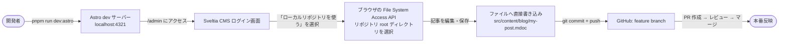

# CMS 編集 → プレビュー → 本番反映フロー

- **関連 ADR**: [0016 — CMS: Sveltia CMS 移行](./adr/0016-cms-keystatic-to-sveltia.md)
- **関連ドキュメント**: [CMS 執筆ガイド](./cms-authoring.md)
- **更新日**: 2026-06-25 (Keystatic → Sveltia CMS 移行 #412)

---

## 概要

keroway.com は **Sveltia CMS（Git ベース CMS）+ Vercel SSG** の構成を採用しています。  
Sveltia は CDN 配信の静的 SPA（`public/admin/`）で、**Astro バージョンに依存しません**。  
コンテンツの正本は `src/content/{blog,works}/*.mdoc` に Git で管理され、CMS はそのファイルを UI 上で読み書きするレイヤーです。

---

## 通常フロー（記事を書いて本番に反映する）


### ポイント

- Sveltia の Editorial Workflow では、UI の「保存」でブランチへのコミットが自動実行される
- Vercel は GitHub と連携しており、PR 作成時に自動でプレビュービルドをトリガーする
- SSG のため、本番反映はマージ後のビルド完了まで数分かかる（通常 1〜3 分）

---

## ローカル編集フロー（開発者向け）

Sveltia はローカル開発で **File System Access API** を使い、OAuth サーバー不要で動作します。



**手順:**

1. `pnpm run dev:astro` で Astro dev サーバーを起動
2. `http://localhost:4321/admin` にアクセス
3. ログイン画面で **「ローカルリポジトリを使う」** を選択
4. ブラウザのファイル選択ダイアログでリポジトリのルートディレクトリを指定
5. 「読み取りと書き込みを許可」の確認ダイアログで許可

> **注意**: File System Access API は Chromium ベースのブラウザ（Chrome / Edge）が必要です。Safari / Firefox は非対応です。

---

## 本番認証セットアップ（OAuth プロキシ）

本番環境での GitHub 認証には **OAuth Authorization Code フロー**が必要です。  
Sveltia の GitHub backend は現在 PAT（個人アクセストークン）の簡易ログインを未実装のため（GitHub の client-side PKCE リリース待ち）、**OAuth プロキシ**を用意します。

### 1. GitHub OAuth App を登録

1. GitHub → Settings → Developer settings → OAuth Apps → New OAuth App
2. 以下の値を設定:
   - Application name: `keroway CMS`
   - Homepage URL: `https://keroway.com`
   - Authorization callback URL: `https://your-auth-proxy.workers.dev/callback`
3. Client ID と Client Secret を記録する

### 2. Cloudflare Workers に sveltia-cms-auth をデプロイ

```bash
git clone https://github.com/sveltia/sveltia-cms-auth.git
cd sveltia-cms-auth
# wrangler.toml を設定してから:
wrangler deploy
# シークレットを登録:
wrangler secret put GITHUB_CLIENT_ID
wrangler secret put GITHUB_CLIENT_SECRET
```

詳細: [sveltia-cms-auth のドキュメント](https://github.com/sveltia/sveltia-cms-auth)

### 3. config.yml に base_url を設定

`public/admin/config.yml` の `backend` セクションを更新:

```yaml
backend:
  name: github
  repo: keroway/astro-blog
  branch: main
  base_url: https://your-auth-proxy.workers.dev  # Workers URL に差し替え
```

---

## URL

| 環境 | URL |
|------|-----|
| 本番 CMS | <https://keroway.com/admin> |
| ローカル CMS | <http://localhost:4321/admin> |
| 旧 Keystatic URL → リダイレクト | <https://keroway.com/keystatic> → /admin |

---

## ファイルフォーマット

- 拡張子: `.mdoc`（Markdoc）
- フォーマット: `yaml-frontmatter`（`---` で区切られた YAML + Markdown 本文）
- Sveltia が書き込むファイルは Astro Content Collections の Zod スキーマで型検証される

```mdoc
---
title: "記事タイトル"
description: "概要"
pubDate: 2026-06-25
category: dev
tags:
  - Astro
draft: false
---

本文をここに書く。
```
