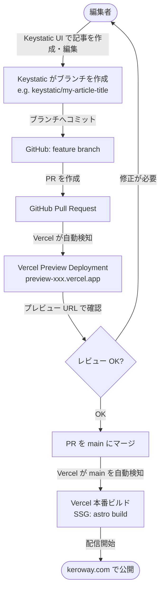
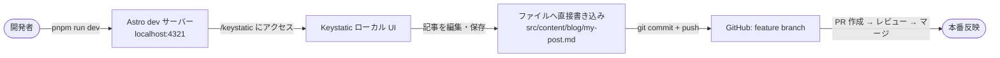
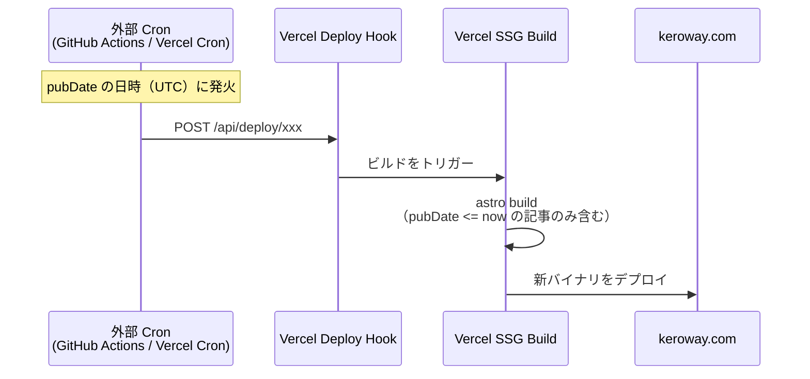

# CMS 編集 → プレビュー → 本番反映フロー

- **関連 ADR**: [0002 — CMS: Keystatic 採用](./adr/0002-cms.md)、[0003 — レンダリング戦略: SSG 継続](./adr/0003-rendering-strategy.md)
- **関連 Issue**: [#34 プレビュー機能とデプロイフローの設計](https://github.com/keroway/astro-blog/issues/34)
- **作成日**: 2026-05-18

---

## 概要

keroway.com は **Keystatic（Git ベース CMS）+ Vercel SSG** の構成を採用します。
記事の正本は `src/content/blog/*.md` に Git で管理され、CMS はそのファイルを UI 上で読み書きするレイヤーです。

---

## 通常フロー（記事を書いて本番に反映する）



### ポイント

- Keystatic のブランチモード（`KEYSTATIC_GITHUB_APP_*` 環境変数設定後）では、UI の「保存」でブランチへのコミットが自動実行される
- Vercel は GitHub と連携しており、PR 作成時に自動でプレビュービルドをトリガーする
- SSG のため、本番反映はマージ後のビルド完了まで数分かかる（通常 1〜3 分）

---

## ローカル編集フロー（開発者向け）



ローカルモードでは Keystatic UI が `localStorage` / ファイルシステムに直接書き込むため、GitHub 認証は不要です。

---

## ドラフト閲覧の方法

`draft: true` を設定した記事は本番ビルドで除外されます。ドラフト状態の記事をレビュアーや本人が確認する方法は以下の 2 つです。

### オプション A: Vercel Preview Deployment URL（推奨）

PR ブランチのビルドが成功すると Vercel が一意のプレビュー URL を発行します。

```
https://astro-blog-git-<branch-name>-keroway.vercel.app/
```

- **メリット**: 追加設定不要。PR にコメントとして URL が自動投稿される
- **デメリット**: URL を知っていれば誰でもアクセス可能（非公開コンテンツを共有しているわけではないが、URLが漏れると閲覧される）
- **適用場面**: 個人ブログで公開前の確認のみなら十分

### オプション B: Vercel Password Protection（要 Vercel Pro）

Vercel Pro 以上のプランで、プレビュー URL にパスワードを設定できます。

```
# vercel.json に追加（Pro プランのみ）
{
  "passwordProtection": {
    "deploymentType": "preview"
  }
}
```

- **メリット**: URL が漏れても認証なしでは閲覧不可
- **デメリット**: Vercel Pro プランが必要（月額 $20〜）
- **適用場面**: 複数人でのレビューや、機密度の高いコンテンツの確認

### オプション C: ローカルプレビュー

```bash
pnpm run dev
# → localhost:4321 で draft 記事も表示される
```

ただし `getCollection` のフィルタが `!data.draft` のため、現状ではローカルでも draft 記事は除外されます。ローカル確認が必要な場合は一時的に `draft: false` に変更するか、dev 環境用のフィルタ分岐を追加してください。

**現在の実装（参考）:**

```typescript
// src/pages/blog/index.astro, src/pages/index.astro
const posts = (await getCollection('blog', ({ data }) => !data.draft))
```

---

## 公開予約（`pubDate` 未来日の扱い）

SSG は**ビルド時点**でサイトを静的出力するため、未来日の記事を自動的に「その日時に公開する」機能はビルトインされていません。

### 現状の挙動

- `draft: false` かつ `pubDate` が未来日の場合 → **ビルド時点では公開される**（現在のフィルタは draft フラグのみ）
- 未来日記事を非公開にするには `draft: true` を明示的に設定する必要がある

### 公開予約を実現する方法

#### 方法 1: 手動 draft 切り替え（現実的・推奨）

```
1. 記事を draft: true で作成・PR マージ（本番には出ない）
2. 公開したい日に draft: false に変更してコミット
3. Vercel が自動でリビルドして公開される
```

- シンプルで確実。個人ブログの規模なら十分

#### 方法 2: Vercel Deploy Hook + 外部 cron（自動化）

Vercel の Deploy Hook URL に対して定期的に POST することで、時刻ベースの自動リビルドが可能です。



**実装例: GitHub Actions での定時ビルド**

```yaml
# .github/workflows/scheduled-publish.yml
name: Scheduled Publish
on:
  schedule:
    # 毎日 JST 9:00 (UTC 0:00) に実行
    - cron: '0 0 * * *'
  workflow_dispatch:

jobs:
  trigger-build:
    runs-on: ubuntu-latest
    steps:
      - name: Trigger Vercel Deploy Hook
        run: |
          curl -X POST "${{ secrets.VERCEL_DEPLOY_HOOK_URL }}"
```

**実装例: Vercel Cron Jobs（`vercel.json`）**

```json
{
  "crons": [
    {
      "path": "/api/trigger-build",
      "schedule": "0 0 * * *"
    }
  ]
}
```

※ Vercel Cron は Vercel Functions エンドポイントを叩く形式のため、SSG のみでは使用不可。SSR adapter が必要。

#### 方法 3: pubDate フィルタをビルド時に適用

```typescript
// src/pages/blog/index.astro - pubDate フィルタを追加する例
const now = new Date();
const posts = (
  await getCollection(
    'blog',
    ({ data }) => !data.draft && data.pubDate <= now
  )
)
```

このフィルタを追加すると、`draft: false` のまま `pubDate` を未来日に設定することで予約投稿が機能します。ただし **ビルドしないと反映されない** ため、方法 2 の cron との組み合わせが前提です。

### 推奨構成

| 要件 | 推奨方法 |
|------|---------|
| 不定期・手動での公開 | 方法 1（draft 切り替え） |
| 定時自動公開（毎日特定時刻） | 方法 3 + 方法 2（GitHub Actions cron） |
| 複数記事の予約管理 | 方法 3 + 方法 2 |

---

## 環境変数一覧（Keystatic ブランチモード）

| 変数名 | 説明 | ローカル | Vercel |
|--------|------|---------|--------|
| `KEYSTATIC_GITHUB_CLIENT_ID` | GitHub OAuth App の Client ID | `.env` | Vercel 環境変数 |
| `KEYSTATIC_GITHUB_CLIENT_SECRET` | GitHub OAuth App の Client Secret | `.env` | Vercel 環境変数（暗号化） |
| `KEYSTATIC_SECRET` | セッション署名用の乱数文字列 | `.env` | Vercel 環境変数（暗号化） |
| `VERCEL_DEPLOY_HOOK_URL` | 公開予約 cron 用のフック URL | 不要 | GitHub Actions Secrets |

> **注意**: `KEYSTATIC_GITHUB_CLIENT_SECRET` と `KEYSTATIC_SECRET` は機密情報のため、`.env` には追加しても `.gitignore` 対象であることを確認してください。

---

## 参考リンク

- [Keystatic ドキュメント — GitHub mode](https://keystatic.com/docs/github-mode)
- [Vercel — Deploy Hooks](https://vercel.com/docs/deployments/deploy-hooks)
- [Vercel — Preview Deployments](https://vercel.com/docs/deployments/preview-deployments)
- [ADR 0002 — CMS: Keystatic 採用](./adr/0002-cms.md)
- [ADR 0003 — レンダリング戦略: SSG 継続](./adr/0003-rendering-strategy.md)
