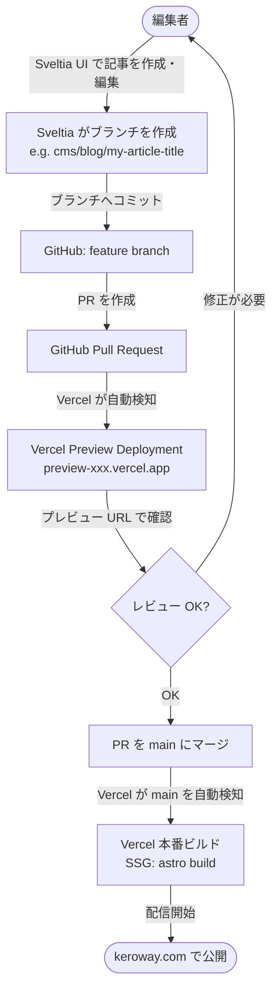

# CMS 編集 → プレビュー → 本番反映フロー

- **関連 ADR**: [0016 — CMS: Sveltia CMS 移行](./adr/0016-cms-keystatic-to-sveltia.md)
- **関連ドキュメント**: [CMS 執筆ガイド](./cms-authoring.md)
- **更新日**: 2026-06-25 (Keystatic → Sveltia CMS 移行 #412)

---

## 概要

keroway.com は **Sveltia CMS（Git ベース CMS）+ Vercel SSG** の構成を採用しています。  
Sveltia は CDN 配信の静的 SPA（`src/pages/admin.astro` + `public/admin/config.yml`）で、**Astro バージョンに依存しません**。  
コンテンツの正本は `src/content/{blog,works}/*.mdoc` に Git で管理され、CMS はそのファイルを UI 上で読み書きするレイヤーです。

---

## 通常フロー（記事を書いて本番に反映する）



### ポイント

- Sveltia の Editorial Workflow では、UI の「保存」でブランチへのコミットが自動実行される
- Vercel は GitHub と連携しており、PR 作成時に自動でプレビュービルドをトリガーする
- SSG のため、本番反映はマージ後のビルド完了まで数分かかる（通常 1〜3 分）

---

## ローカル編集フロー（開発者向け）

Sveltia はローカル開発で **File System Access API** を使い、OAuth サーバー不要で動作します。


**手順:**

1. `pnpm run dev:astro` で Astro dev サーバーを起動
2. `http://localhost:4321/admin` にアクセス
3. ログイン画面で **「ローカルリポジトリを使う」** を選択
4. ブラウザのファイル選択ダイアログでリポジトリのルートディレクトリを指定
5. 「読み取りと書き込みを許可」の確認ダイアログで許可

> **注意**: File System Access API は Chromium ベースのブラウザ（Chrome / Edge）が必要です。Safari / Firefox は非対応です。

---

## 本番認証セットアップ（OAuth プロキシ）

ここは **リポジトリオーナーの GitHub / Cloudflare 権限と secret 扱いが必要**なため、通常はサイト管理者が実施します。コード側の Sveltia CMS 本体・コレクション定義・`/admin` ルーティングはすでにリポジトリに入っています。

本番環境で非技術者を含む編集者が使う場合は、Sveltia 公式の推奨どおり **OAuth Authorization Code フロー**を用意します。GitHub OAuth App の Client Secret をブラウザへ置かないため、Cloudflare Workers の `sveltia-cms-auth` を OAuth プロキシとして使います。

> **補足**: Sveltia には GitHub access token でのログイン導線もありますが、複数人運用・非技術者運用では OAuth プロキシの方が UX / secret 管理の面で安全です。このサイトの本番運用手順は OAuth プロキシを標準とします。

### 作業分担

| 作業 | 実施者 | 理由 |
|------|--------|------|
| `src/pages/admin.astro` / `public/admin/config.yml` の Sveltia CMS 配置 | agent / 開発者 | コード変更のみ |
| `config.yml` の collection 定義 | agent / 開発者 | コード変更のみ |
| Cloudflare Workers の作成 / デプロイ | サイト管理者 | Cloudflare アカウント権限が必要 |
| GitHub OAuth App の作成 | サイト管理者 | GitHub アカウント / organization 権限が必要 |
| `GITHUB_CLIENT_SECRET` 登録 | サイト管理者 | secret を扱うため agent に渡さない |
| `base_url` の実 URL 反映 | agent でも可 | Workers URL が分かれば通常のコード変更 |

### 1. Cloudflare Workers に sveltia-cms-auth をデプロイ

Cloudflare ダッシュボードの **Deploy to Cloudflare Workers** ボタンを使うか、ローカルの `wrangler` でデプロイします。

```bash
git clone https://github.com/sveltia/sveltia-cms-auth.git
cd sveltia-cms-auth
pnpm install
pnpm exec wrangler login
pnpm exec wrangler deploy
```

デプロイ後、Workers URL（例: `https://sveltia-cms-auth.<subdomain>.workers.dev`）を控えます。

### 2. GitHub OAuth App を登録

GitHub → Settings → Developer settings → OAuth Apps → New OAuth App で以下を設定します。

| 項目 | 値 |
|------|----|
| Application name | `keroway CMS` |
| Homepage URL | `https://keroway.com` |
| Authorization callback URL | `<Workers URL>/callback` |

登録後に **Client ID** と **Client Secret** を控えます。

### 3. Worker に環境変数 / secret を設定

Cloudflare ダッシュボード（Workers → Settings → Variables）または `wrangler secret put` で設定します。

```bash
pnpm exec wrangler secret put GITHUB_CLIENT_ID
pnpm exec wrangler secret put GITHUB_CLIENT_SECRET
pnpm exec wrangler secret put ALLOWED_DOMAINS
```

`ALLOWED_DOMAINS` には `keroway.com` を設定します。Preview 環境でも CMS を使う場合のみ、必要な preview hostname を追加します。

### 4. config.yml に base_url を設定

Workers URL が確定したら `public/admin/config.yml` の `backend` セクションを更新して PR 化します。

```yaml
backend:
  name: github
  repo: keroway/astro-blog
  branch: main
  base_url: https://sveltia-cms-auth.kurokawa-y.workers.dev
```

この `base_url` 反映は secret を含まないため、URL を共有してもらえれば agent が実施できます。

---

## URL

| 環境 | URL |
|------|-----|
| 本番 CMS | <https://keroway.com/admin> |
| ローカル CMS | <http://localhost:4321/admin> |
| 旧 Keystatic URL → リダイレクト | <https://keroway.com/keystatic> → /admin |

---

## ファイルフォーマット

- 拡張子: `.mdoc`（Markdoc）
- フォーマット: `yaml-frontmatter`（`---` で区切られた YAML + Markdown 本文）
- Sveltia が書き込むファイルは Astro Content Collections の Zod スキーマで型検証される

```mdoc
---
title: "記事タイトル"
description: "概要"
pubDate: 2026-06-25
category: dev
tags:
  - Astro
draft: false
---

本文をここに書く。
```
